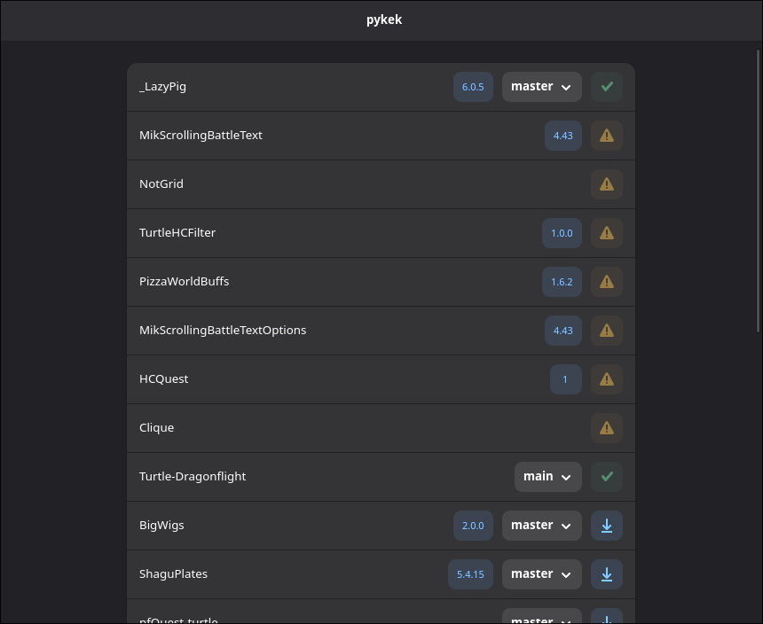

# pykek

🐍 **pykek** is a git addons manager for World of Warcraft.

  

## Dev notes

I developed this tool for myself because I wanted an addon manager with a nice, modern GTK+Adwaita UI. And also because I wanted to develop a desktop GUI app for a long time 😊.

**Trigger warning:** This is my first time using Python and as a result the source code could be horribly non-pythonic. 

## Features

- Update your git-versioned addons! 🔄
- Easily switch between different addon branches 🌱
- Link addons that are not git-versioned to a git repository 🔗

### What's coming (in no specific order)

- Addons backup 💾
- Support for multiple WoW instances 🗃️
- Addons management (adding, ignoring and removing addons) 🖊️
- Flatpak distribution 📦

## Compatibility

- Linux ✅
- macOS ❓
- Windows ❓

## Getting Started

This project has only been tested on Arch Linux, so please adapt these instructions to your distribution of choice.

### Prerequisites

- `python3` >= 3.13
- `gtk4`
- `libadwaita`

### Running

Consider installing [uv](https://github.com/astral-sh/uv), running `uv run main.py` will take care of venv and python dependencies for you!

## License

This project is licensed under the [GPL-3.0](LICENSE.md) license.

## Credits

  - [game-icons.net](https://game-icons.net/) for the app icon
